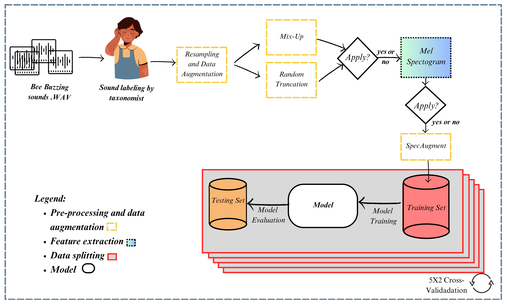
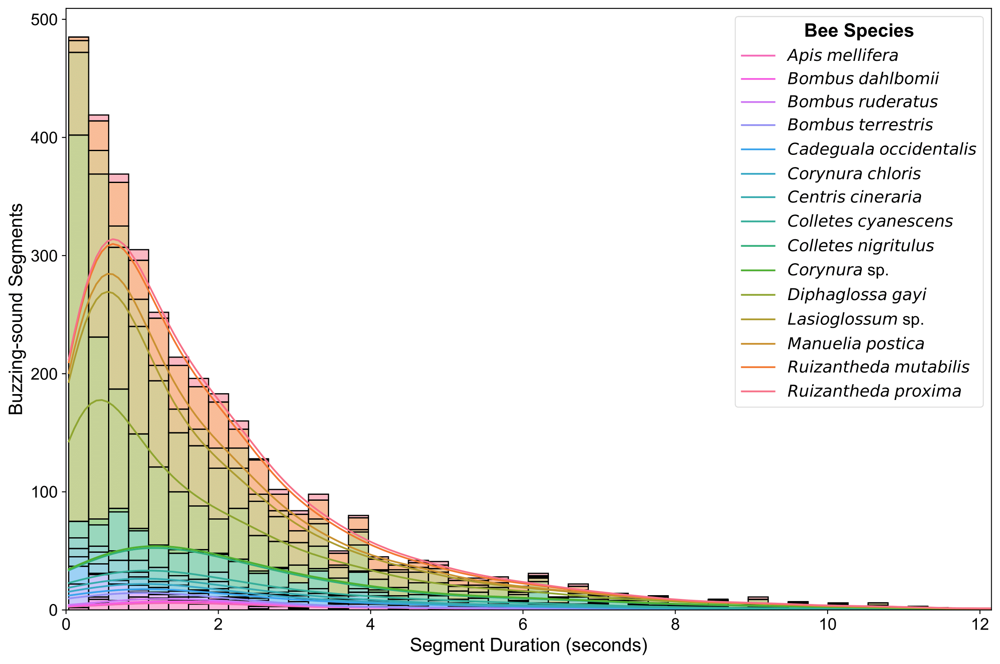

# Acoustic Recognition of Blueberry-Pollinating Bee Species

This repository contains the code for the paper titled **"Transformer Models Improve the Acoustic Recognition of Crop-Pollinating Bee Species"**. The study focuses on improving the recognition of bee species through their buzzing sounds using transformer-based neural network models.

## Table of Contents
- [Introduction](#introduction)
- [Requirements](#requirements)
- [Dataset](#dataset)
- [Model Training](#model-training)
- [Contributors](#contributors)
- [License](#license)

## Introduction

The recognition of bee species through their buzzing is critical for understanding their role in pollination, particularly for crops like blueberries that rely on buzz pollination. This repository implements transformer-based models, such as Audio Spectrogram Transformer (AST), to enhance the recognition of these sounds. The project outperformed traditional CNN models, achieving state-of-the-art results in recognizing 15 different bee species based on their acoustic profiles.

<div align="center">
  
</div>

## Requirements

The code is implemented using Python and requires the following dependencies:
- Python 3.10.14

Clone the repository and navigate to the project directory:

```bash
git clone https://github.com/alefiury/Transformers-Bee-Species-Acoustic-Recognition.git
cd Transformers-Bee-Species-Acoustic-Recognition
```

Install the necessary Python libraries using the following command:

```bash
pip install -r requirements.txt
```

## Dataset

The dataset used for this project comprises 518 audio samples (in which each sample is divided in smaller segments) from 15 different bee species visiting blueberry flowers in Chilean orchards. The samples contain both sonication and flight buzzing events.

<div align="center">
  
</div>

## Model Training
The repository includes the implementation of three transformer-based models:

- [Audio Spectrogram Transformer (AST)](https://github.com/YuanGongND/ast)
- [Self-Supervised Audio Spectrogram Transformer (SSAST)](https://github.com/YuanGongND/ast)
- [Masked Autoencoding Audio Spectrogram Transformer (MAE-AST)](https://github.com/AlanBaade/MAE-AST-Public)
To train the models, run the following command:

```bash
python3 main.py --config-path PATH_TO_CONFIG_FILE --choose-model ast
```

Options of models: effnet, panns, psla, ast, mae_ast, ssast

## Hyperparameters
The hyperparameters for each model are configurable through the config.yaml file. Default values have been set based on the experiments conducted in the paper.

## Contributors
This research was conducted by:

- Alef Iury Siqueira Ferreira
- Nádia Felix Felipe da Silva
- Fernanda Neiva Mesquita
- Thierson Couto Rosa
- Stephen Buchmann
- José Neiva Mesquita-Neto

## License

This project is licensed under the MIT License - see the [LICENSE](LICENSE) file for details.
